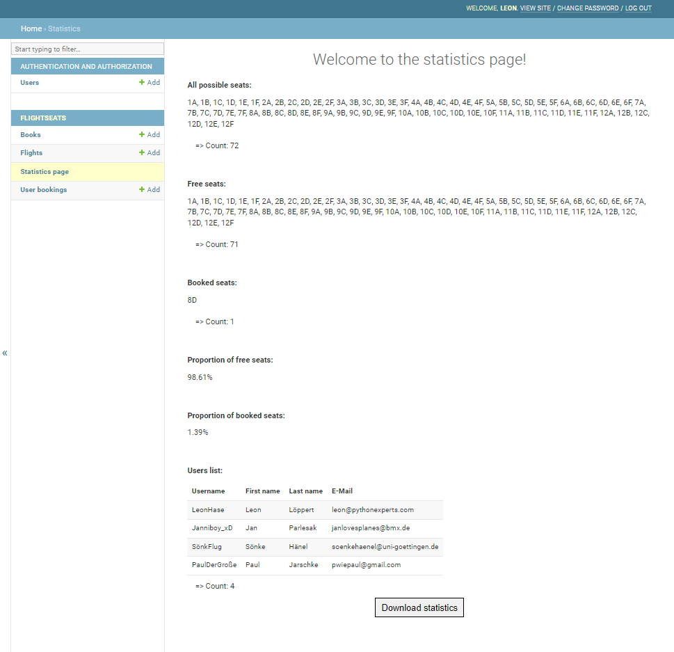
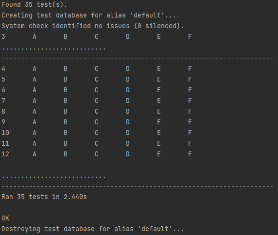

## AngStHasenFlights

AngStHasenFlights is an easy-to-use web-based application to book seats on flights and to process and store bookings
automatically.
This application gives customers the possibility to register, log in, get an overview of reserved and free seats on
flights and the possibility to reserve seats.
Administrators can add flights and manage existing user accounts, flights and bookings via the admin page. Admins can
also view and download statistics about the flights.

## Motivation

The purpose of a seat reservation system is to provide customers with a simple, flexible and convenient way to book
flights, and to make processes efficient by avoiding the need for resources for manual entries and corrections through
automatic bookings.
A more academic motivation was to put our python skills into practice in the context of this project.

## Features

- Easy setup and use after installation
- Maintainability and extensibility due to modular MVT scheme of django framework

## Installation

Please make sure you are using a version of Python that is not older than Python 3.8!

Please follow the following steps to install the AngStHasenFlights Django environment:

1. Clone the repository using the command line command: "git clone https://github.com/prichi99/AngStHasen.git".
2. Open the project-folder "AngStHasen/project/seats" of the project in your terminal with the cd command
3. Install the required dependencies. To do this, just enter the command "pip install -r requirements.txt" in the
   terminal.
4. Start the project with the command: "python manage.py runserver"

## Database troubleshooting:

1. If you do not use our database on the first runup, you need to perform the following commands in the respective order
   to get the server running:
    - python manage.py makemigrations
    - python manage.py migrate
    - python manage.py runserver
2. When there are further database errors, delete the database and all migration files (except the __init__.py) and
   retry step 1.

### Predefined custom users

- This application features sample users out of the box **which should be deleted before the software is taken into
  daily business!!**

| Username     | password              | admin |
|--------------|-----------------------|-------|
| LeonHase     | notafraidofflying1999 | yes   |
| Janniboy_xD  | ichmagflugzeuge_x3    | no    |
| SönkFlug     | appliedstatisticsftw  | no    |
| PaulDerGroße | lecker!paulanerspezi  | no    |

### User functions

- Typical user functions like register, login, logout and a help page are implemented on the website.
- In our demo version users can only select one flight (HAM to ARN). For this flight they can reserve free seats in the
  respective page, see depiction below:

### Admin functions:

- Users with admin rights are shown and granted access to the admin page.
- Admins (and only admins) can edit and delete users, bookings and flights.
- Admins can change the seat layout by uploading a new "chartIn.txt" file.
  However, it is important that the format defaults are maintained: The first representing the headings for the
  columns
  representing the seats; the first column representing the rows of seats in the aircraft. Please make sure that you
  include the six seat letters from A to F only.\
  Example:\
  1 A B C D E F \
  2 A B C D E F \
  3 A B C D E F
- Administrators can access and download a statistics page that displays the number and proportion of free and reserved
  seats, as well as lists of all available and unavailable seats. Further, all user information (except
  passwords) are shown. The information can be downloaded to a text file. See depiction below:

## Tests

For our application, we included unittests for user-inputs. This applies to the registration of new users, the login of 
valid users, the seat reservation and the upload of a seat-layout (chartIn.txt). Additionally, we included many other 
unittests to test the functionality of our models, urls, forms and views that sum up to a total number of 35 tests.

Running all test at once is fairly simple:

1. Open the project-folder "angsthasen/project/seats" of the project in your terminal
2. Run the command: python manage.py test

If you did everything correctly, your terminal should return this:

You can also run the different test independently, by selecting the desired class/method and running it manually.
There are two different folders that contain all test files and can be found under the following directories:

In the following we listed both folders with their corresponding tests.

"AngStHasen/project/seats/flightseats/test_flightseats"
- Booking function
- Txt import
- Login
- Models, URLs, Views

"AngStHasen/project/seats/users/test_users"
- Forms, URLs, Views (mostly testing the registration in various ways)

## Contributions:

Leon Löppert:

- Login/Logout integration (esp. conditional header and text on home after login, logout page)
- Booking function (reservation/cancellation)
- Custom data setup (Users, Flights)
- ChartIn fileread and overwrite
- Seat display with the help of ChartIn_reservations.txt
- Javascript (esp. SweetAlert notifications for booking, logout)
- Refactoring html files/Webpage design/Header/Navigation bar improvements
- Statistics (setup/Formatting/Download button)

Jan Parlesak:

- Django framework and project setup
- Statistics download http request
- Login/logout/registration
- User, Flight, and Book model implementation
- Navigation bar implementation
- ChartIn upload

Sönke Hänel:

- Home page
- Help page
- Webpage design
- Logo design
- Readme

Paul Jarschke:

- Booking function (reservation/cancellation)
- Testing
- Refactoring/commenting
- Code style

## License Agreement

### Power of Attorney Statement

I, the signee, am working on the project 'AngStHasenFlights' under the supervision of Prof. Dr. Bela Gipp. The
specified project involves the creation of software and documentation that shall be placed under an open source license.

I hereby grant Prof. Dr. Bela Gipp full authorization to perform any legal acts necessary, including making declarations
on my behalf, in order to irrevocably place any software and documentation created as a result of my project under an
open source license, e.g. Apache 2.0. The type of license remains at the discretion of Prof. Gipp, as long as it is an
open source license. I am aware that this will permanently exclude any commercial exploitation of my copyrights.

I hereby confirm that I have read and understood the Apache Licence 2.0
at: https://tldrlegal.com/license/apache-license-2.0-(apache-2.0)#fulltext

Göttingen, 31.01.23

Leon Löppert, Jan Parlesak, Sönke Hänel, Paul Jarschke
