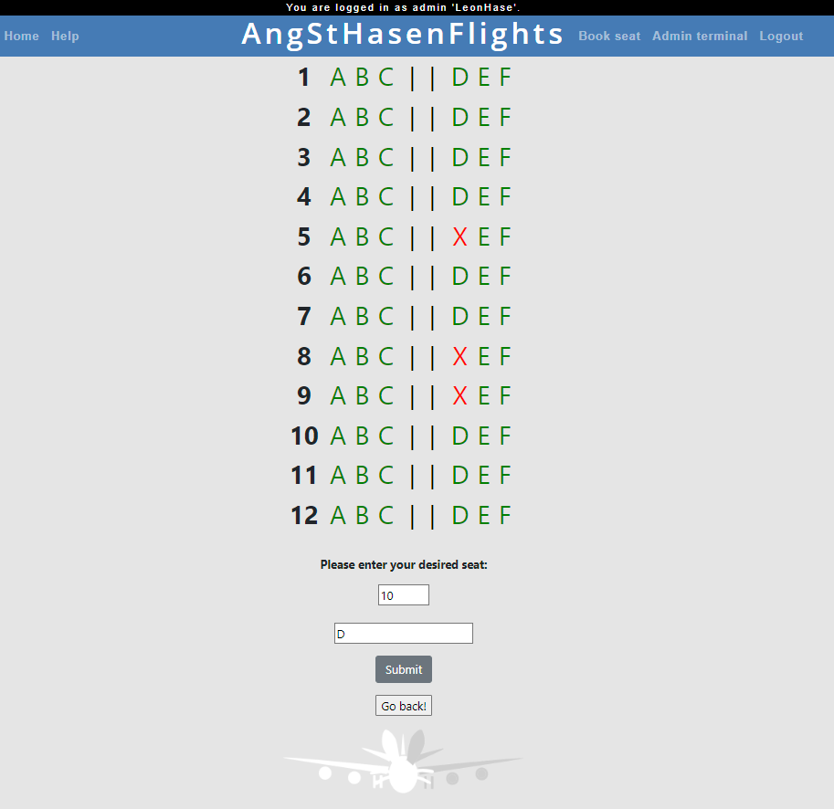

## AngStHasenFlights

AngStHasenFlights is an easy-to-use web-based application to book seats on flights and to process and store bookings automatically. 
This application gives customers the possibility to register, log in, get an overview of reserved and free seats on flights and the possibility to reserve seats.
Administrators can add flights and manage existing user accounts, flights and bookings via the admin page. Admins can also view and download statistics about the flights.

## Motivation
The purpose of a seat reservation system is to provide customers with a simple, flexible and convenient way to book flights, and to make processes efficient by avoiding the need for resources for manual entries and corrections through automatic bookings.
A more academic motivation was to put our python skills into practice in the context of this project.
 
## Features
- Easy setup and use after installation
- Maintainability and extensibility due to modular MVT scheme of django framework

### User functions
- Typical user functions register, login, logout and get help from the website are implemented.
- Users can choose an airline and select and reserve free seats in the overview there, see depiction below:

### Admin functions:
- Users with admin rights are shown and granted access to the admin page.
- Admins (and only admins) can edit and delete users, bookings and flights.
- Admins can change the seat layout by editing the file "chartIn.txt". 
However, it is important that the format defaults are maintained: The first representing the headings for the columns representing the seats; the first column representing the rows of seats in the aircraft. Each aircraft has an even number of seats evenly distributed on two sides.
- Administrators can access and download a statistics page that displays the number and percentage of free and reserved seats, as well as lists of all available and unavailable seats and their number, and all user information (except passwords), see depiction below:

## Installation
Please make sure you are using a version of Python that is not older than Python 3.8!

Please follow the following steps to install AngStHasenFlights:
1. clone the repository using the command line command: "git clone https://github.com/prichi99/AngStHasen.git".
2. open the project-folder "angsthasen/project/seats" of the project in your terminal
3. install the required dependencies. To do this, just enter the command "pip install -r requirements.txt" in the terminal.
4. start the project with the command: "python manage.py runserver"

## Tests (optional: only if you have tests)
Describe and show how to run the tests with code examples.

## Contributions:
Leon: statistics area, login/logout integration, base conception, seat reservation/cancellation, depiction of the seats, default accounts, fileread implementation, help page
Jan: statistics area, login implementation, login/logout integration, navigation bar implementation,
Sönke: starting page, help page, graphics, readme
Paul: refactoring of functions, communications management, quality management and adherence to the PEP 8 Style Guide and best practice guidelines, exhaustive commenting, exhaustive programming of tests
